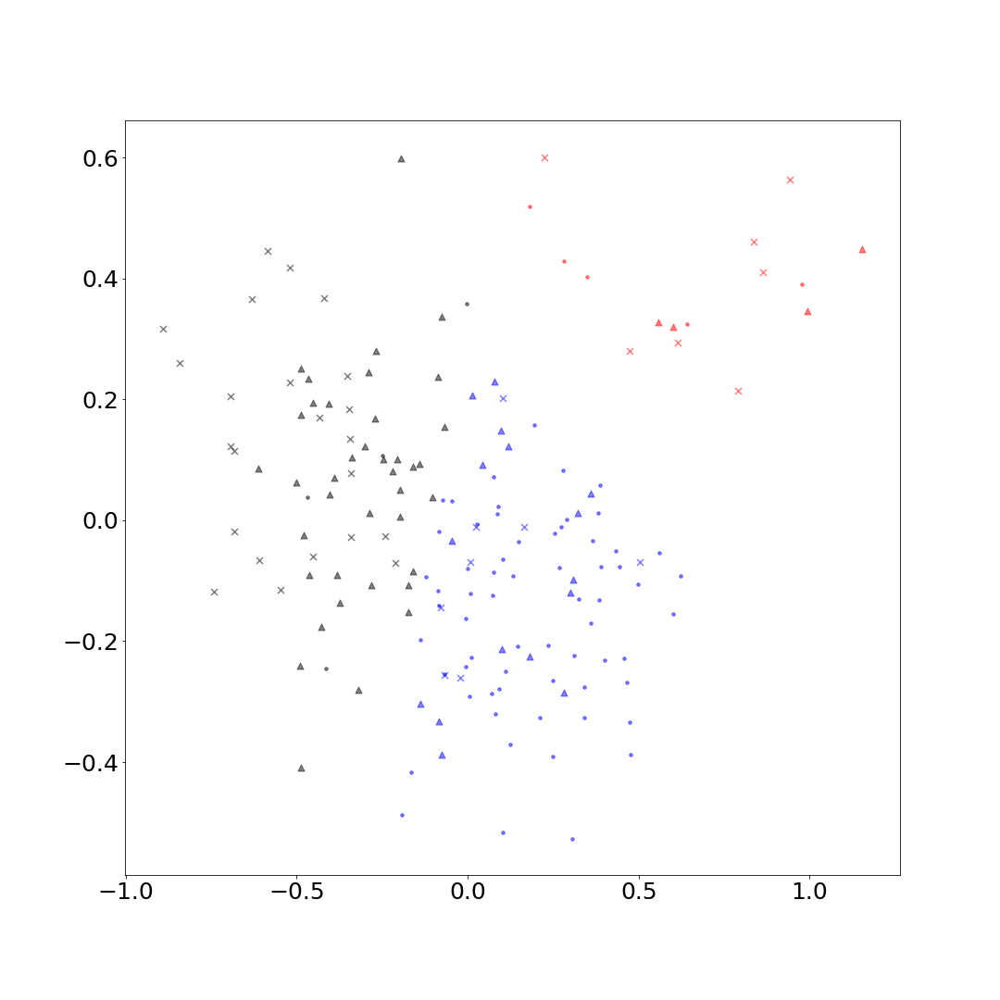
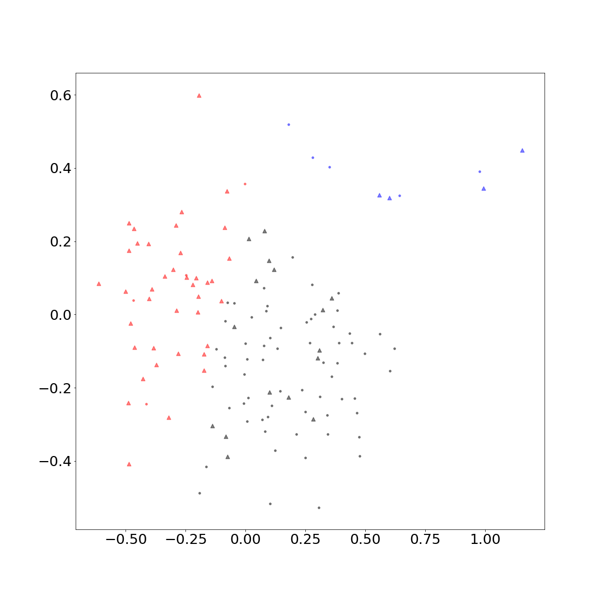
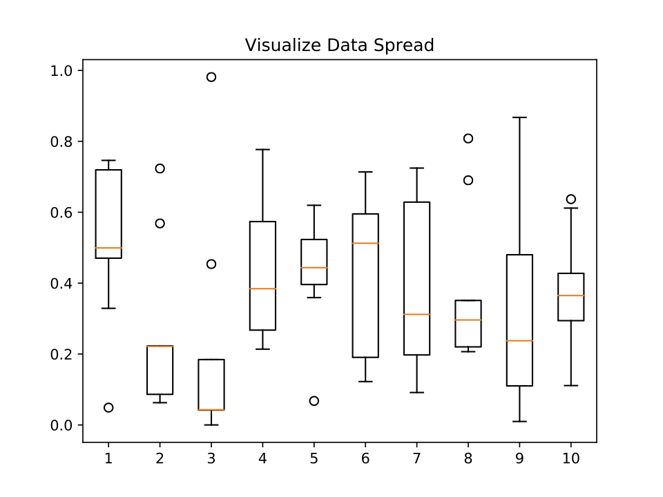

# Analysis of soccer data with kmeans

| Jesus Badillo, Xandria McDowell, Ben Yeagley 
| jebadi@iu.edu, xmcdowel@iu.edu, byeagley@indiana.edu
| Indiana University Bloomingtion,
| hid: sp19-222-92 
| github: [:cloud:](https://github.com/cloudmesh-community/sp19-222-92/blob/master/project-report/report.md)
| code: [:cloud:](https://github.com/cloudmesh-community/sp19-222-92/tree/master/project-code)


## Abstract 

Data collected by wearbale devices used by the Indiana University Women's soccer
team was used to classify the six unique offesive and defensive positions
excluding the goaltender. Successful classification of positions from wearable
data using machine learning techinques could provide talent evaluators and
coaches with an extra tool to help increase on field productivity. The k-means
algorithim was used in order to classifiy the data from wearble devices into six
unique positions. This is the first step towards creating a workflow for using
machine learning as a talent evalution tool for soccer players. Once the ability
to successfully classify data from wearable devices into unique positions
additional layers of complexity can be added, like comparing professional
athletes or collegiate athletes to prospects. A framework for the implemtnation
of classfiying soccer postions has been implemented with Scikit-learn libraries
in python3. OpenAPI Specification was used in order to create a service that
exploits the Scikit-learn libraries through an easy user interface.

## Introduction

Can data gathered from athletic practices and games be used to create benchmarks
for how an athlete playing a specific position should perform?  Recent
advancements in wearable technologies has allowed data from sensors to instantly
improve how machines and people perform. These advancements are now being used
in sports to make computations to player data to get future insight on how to
improve the overall team. For example, the popular movie Money Ball focused on
how analytics can be used to assemble a competitve professional baseball
team. This type of analysis can show users what datapoints are shared by top
players allowing coaches to pick their players accordingly. Soccer uses sports
data to improve the physical attributes, such as stamina and pace, of each
individual player since it is a more technical sport that cannot just use
quantitative data to make decisions. The field of sports analytics has been
changed by machine learning techniques that have been adapted to use the hard
numerical data received from edge-computing devices to improve teams.

### Sport Analytics 

The rapid innovation of technology has infiltrated many fields including sports
analytics because it has created more data that can show coaches what athletes
need to improve on. Edge computing is the technology that has led to the massive
increase in more refined sports data because of its ability to provide a
real-time numerical representation of what happened on the field. With this
numerical data, actions can be taken to rapidly improve each player specifically
on the areas where they need immediate attention. Edge computing is computing
that is done near the source of the data, and it uses the cloud's ability to
compute from a remote source to get instant data from a device. Edge-computing
has allowed sensors to get more accurate data without disturbing the players
which has given many sports a new way to get an advantage over their
competitors.

### Sensors in Sports 

Sensors have become more prominent in sports due to recent advancements in
biomedical engineering which have made sensory technology better to create more
informative data. These new innovations in sensory technology can now measure
data points such as “temperature, oxygen saturation levels, and heart rate
(SpO2) through photo optic sensors in wearable rings and wrist
devices”[@sensors_in_sports].  These new advancements are necessary because now,
more than ever, “the differences between athletes are becoming more and more
slight”[@sensors_in_sports] which has led coaches and trainers to look to data
analytics to get an advantage. By putting small sensors into players’ training
equipment, we can detect important aspects of playing a sport such as muscle
exertion, heart rate, and respiration. Sensors can provide immediate feedback to
the athletes. For example, when attached to player attire, “accelerometers and
conductive materials can measure posture and provide real-time feedback to
athletes so they can perfect their form”[@sensors_in_sports].

Soccer has recently began to adopt the use of technology in many
different ways such as the Adidas MiCoach ball, which is a regular
sized soccer ball with a built in sensor that can detect the power,
spin, and accuracy of a players kick. This ball allows players and
coaches the to see how the athlete shoots the ball through an iOS or
Android device to improve the players shooting form. This type of
sensor is mainly used for beginners, professionals tend to focus on
the more physical side of data collection such as wearable sensors
that track physical stats. The Catapult Sports Playertek is a
compression vest with a built-in sensor that has an accelerometer,
magnometer, and a GPS that can track athletes' performance during
practices. The IU Women's soccer team uses sensors like the Playertek
to get athlete data because it allows the coaches to know what
physical attributes to track for each player when they are training or
playing.

## Soccer Dataset 

Practice and game data from the IU Women's Soccer team
was used in this analysis. The results of this analysis aims to
leverage 'sensed' athlete data to show coaches and players if players
are performing optimally. The Women's team data has 34 individual
columns such as sprints, accelerations in varying ranges, and
heartrate that are weighted based on how much time the individual
played. Some data points, such as sprints, can be used to improve the
athlete in a certain aspect of their sport, in this case by increasing
the number of sprints they have during a game. Using data in this way
can help the player improve their speed, but it will do very little to
improve their overall ability. Instead the Kmeans Clustering method
will show the entire team how they compare to each other and the ideal
player of their respected position, so that the entire team can
improve. By using Kmeans on the data each player can improve how they
play, not just how fast they can run. The Kmeans algorithm is optimal
for this dataset because it uses eight different datapoints to
determine how well each player is playing their position compared to
how they should be. This method provides a literal target from which
players can see which areas they specifically need improvement on to
reach the centroid, or the ideal player for that position.
  
Clustered data can be used to compare players to other players who
play the same position in different divisions, levels, etc. This
method can sometimes be inefficient because what is *good* can vary a
lot in soccer, due to it being based on skill rather than physical
attributes.  For example, some defenders do not run very much at all,
but instead rely on their ability to read players movements to stop
the opposing players from getting past them. This would be a great
data point that could likely be used to create more accurate models
that can help the players distinguish themselves from the other
positions in terms of how they should be performing. The problem is
that sensors are limited to numerical data, so this type of ability
cannot be measured. To avoid any of these limitations, the Women's
Soccer team data has many of the same data points measured in
different ranges. For example, the *Number of Accelerations* category
has eight different ranges which are either a deceleration or an
acceleration. This way of splitting data could transcend the inability
to measure the *intangibles* because it measures the same data points
at different instances which tend to vary by position.
  
The Women's team data was obtained from the 2018 season where they
faced off with many other Big 10 schools. There were eleven datasets
which each contained a row for each of the players where you could see
their names and all of their data points for that particular
game. Since each dataset had only 23 data points we decided to join
all of the datasets into one big dataset where the players' names were
removed and replaced by the player's positon into a column called
*Class*. The original datasets that were given to us did not contain
how many minutes each player played, which could alter how the kmeans
algorithm clusters the players. The algorithm would likely cluster the
players wrongly if the *Minutes Played* column was not added because
it would give the players who are substitutes higher values without
taking into accountthe amount of time that they played during a
game. In soccer, the amount of time you play can especially effect
many of your stats because the sport is largely based on endurance
with a few short bursts of sprints. The substite players who had no
game time were removed from the dataset because they could alter how
the algorithm clusters a good stat vs. a bad stat. Once the extraneous
data points were removed there were only 170 rows left which all had a
label of either Mid-fielder, Forward, or Defender. The label was used as
the prediction variable to give insight as to where the kmeans-computed 
clusters should be centered. The Kmeans algorithm uses the labels to
predict the outcome of each of the 170 rows' stats against the 
kmeans-computed stats.

## Algorithm Discussion 

### K-means

K-Means is an unsupervised machine learning algorithm that takes an unlabeled
dataset and finds groups within data without defined categories. Unsupervised is
learning from data that are unlabeled meaning you don’t know what the values of
the output data might be.  The idea is to look at the average or mean values
that can be clustered and how they can be related to the k groups. K is also
known as centroids which is a data point at the center of each cluster. Each
cluster is placed in a certain position because depending on how close the
clusters are to each other will change the results. Which is why the placement
of the cluster are important because the layout of centroids will determine the
results. In K-Means the centroids are randomly selected and then used as the
cluster of each point.  After the centroid is placed then all the data point is
split up into the correct centroids based on the data point that they are. Now
that the data points have a home the next step is re-calculation of k to
optimize the position of the centroid. This process of optimization continues to
happen until centroids have stabilized or a certain number of iterations have
occurred. When using this algorithm, the hope is that the results can explain
why common parameter values are in the same group. This algorithm takes
numerical values or data points that describe a coordinated value within a data
set and cluster them according to the given k. For example, K- Means is
beneficial for this project because it's able to focus on a particular data set
for the women's soccer team at Indiana University (IU) and compare that to users
data. K-Means coordinates can represent and describe many different things such
as elections, medical test, sports teams, or wine data. Typical you use K-means
on a dataset to get the model of the data, this is used to see the behaviors and
analyze the patterns the data set. When using clustering methods variance
becomes an important topic trying to understand the math behind this
algorithm. Variance is a measurement of how far data values are from the
mean. By look at the variance equation, it shows that it is a measure of the
square difference between the data points and the mean value and then the
average. When using the K-means algorithm one of the key points is to measure
the closeness of the data to its average which led into cluster variance which
divides the data into clusters, each will have its own average. While there are
many different machine learning algorithms K-Means worked best because it takes
a unsupervised data set which was need in this case. While K-Means gives an
optimal cluster model, spectral cluster is better. The K-means objective
function is given in @eq:obj-func.

$$\sum_{j=1}^k\sum_{i=1}^n{\|x_{i}^{(j)} - c_j \|}^2$${#eq:obj-func}

### Spectral Clustering

Before landing on K-means to be the machine learning algorithm, spectral
clustering was the set machine learning algorithm for finding out how close
people were playing against Indiana University womens soccer team. A commonly
used algorithm for classification that has become popular in recent years is
spectral clustering [@von2007tutorial]. This algorithm can be effectively solved
by using standard linear algebra methods and, software. For the most part, it is
known to outperform K-means which is what was seen with this data set. Spectral
clustering uses the data points as nodes of a graph, which are then treated as
partitioning points and mapped to a low-dimensional space making it easier to
form clusters. Spectral clustering follows an approach where if the points are
extremely close to each other they are put into the same cluster, even if the
distance between them is within a two point range if they are not connected they
are not clustered. While k-means points can be within the same range and still
fall within the same group because it is measured by the distance between the
data. This data set has many points where they are considered within range of
each other which is why spectral clustering gave better results. In spectral
clustering the data is connected within a way that leds to the data points
falling within the same cluster. The problem arises when using spectral
clustering because the project aims to show people how they played compared to
Indiana University soccer players but when trying to show their data and the
soccer players data on the same plot issues arise. This happens because you can
not get the labels using spectral clusters so the use would not know where they
where. spectral equation below.


$\left(\frac{1}{2}\right) \displaystyle\sum_{i, j=1}^{n} w_ij(f_i - f_j)^2$


### Dimensional Reduction 

Dimensional reduction was something that was needed for this data set because
there were many points within one players statistics. Having multiple points,
was too much for K-means to give explainable results. Dimension reduction
allowed the data set to be reduced to a certain number of random variables by
obtaining a set of key variables. Looking at dimension reduction from the math
perspective there are the non-linear and linear methods. Typically, the Linear 
method is used because it is easier to implement. In the linear calculation 
results in each variable being apart of a linear combination of the initial
variables such that $k \geq p$ see @eq:dim-red. 

$$S_i = w_ix_i + … w_ipxp for I = 1,…, k$${#eq:dim-red}

where

$S = Wx$

Wx represents the weighted matrix in linear conversion. $Ap*k$ is the same as $x
=As$ which are new variables or $s$ identified as hidden or latent variables
according to [@fodor2002survey]. When using the matrix $X$ in terms of $n x p$
@eq:lin is applied.

$$S_ij = w_1jW_1j + … w1pXpJ for I =1…,k and j = 1…,n$${#eq:lin}

According to @fodor2002survey this is the easiest linear technique to use. 


## Results

Normally a clustering model cannot be scored for its accuracy; there are no true
labels in unsupervised learning to compare with the clustering models predicted
labels [@k-means-clustering]. However, in our case each of the fitness data points
had the player name associated with it, so we were able to replace each name in
the dataset with their position on the field (the predicted value). Converting
these positions to numeric representations gave us a list of true labels to use
for scoring. We found each players position by taking the position listed on the
team roster page. Of course, some players may play in different positions
throughout the season, so some of the labels may be incorrect. Our labelling
process was the best we could do with the information available. We focused on
three evaluations for our model: completeness, homogeneity, and
v-measure. Completeness is a measure of how well each class was clustered
together [@scikit-completeness], while homogeneity scores the clusters based on
what degree in contains only one class [@scikit-homogeneity]. The harmonic mean of
the completeness and homogeneity scores gives the v-measure score
[@wikipedia_2019-harmonic-mean] [@scikit-vmeasure]. Each is considered perfect if
their score is 1.0. Conversely, 0.0 is the worst possible score. The results of
our clustering model can be seen in @tbl:results-table. had a completeness score
of .260, homogeneity score of .227, and a v-measure score of .242. This means
our model was more effective at clustering the classes together than having each
cluster contain purely one class. Overall, the model scored poorly. Its scatter
plot [@kaggle]:

{#fig:scatter}


Looking at the scatter plot showing the clusters and the data points true
labels, we can see that the poor score can be mainly attributed to the general
failure to classify forwards (x's) correctly. The defenders (dots) and
midfielders (triangles) have fairly defined clusters themselves, and viewing the
scatter plot without the any forward data points makes it even more apparent.

{#fig:no-forward}


The black cluster was split almost 50/50 between forwards and midfielders
despite them being decently separated groups, mainly because the model
identified the outliers of the dataset as the red cluster. It's possible that if
the dataset was cleaned up by removing the outliers before clustering, the model
would've separated the classes much more accurately. Outliers as defined by our
boxplot are shown here [@nishida_nishida_2018] [@seif_2018]:
 
A Boxplot of the data after normlization is given in @fig:boxplot.
  
{#fig:boxplot}


Our method for removing the outliers could have involved calculating a Z-Score
for each data point, which gives the amount of standard deviations a point is
from the mean of the dataset, and then getting rid of points with a Z-Score
above a certain amount of standard deviations [@sharma_sharma_2018]. However, it's important to
determine if the points in that top-right cluster would even qualify as true
outliers or if they are just points the clustering model is unable to
predict. We might need to investigate those points in the original dataset to
see if there is a discernable pattern to them because theoretically, the data
shouldn't have any anomalies unless the measuring device malfunctioned. It could
even be a specific game that led to those points being separated; the game could
have been much more intense than normal, leading to higher numbers for each
player that participated. Disregarding them just to improve the models accuracy
may not be the right choice.

: Results of our k-means analysis {#tbl:results-table} 

| completeness | homogenitiy | v-score |
|--------------|-------------|---------|
| 0.260        | 0.227       | 0.242   |


## Analysis

A necessary question to ask is: is the low v-measure score of the model due to
possible errors in the dataset like those discussed above, an incorrect choice
of machine learning method, a general unpredictability of player position with
the type of data given, or some other reason? To examine the second possibility
(wrong method), we split up the data into training and testing using
train_test_split from sklearn, and then we added a variety of other
classification techniques to the project code [@wikipedia_2019-multiclass]. The
first technique was Multinomial Logistic Regression, a method that uses a linear
combination of the predictor variables to model the dependent variable
(position) [@abhishekabhishek]. The model had an accuracy score of .63 for our
training data and .60 for our test data. The next technique we employed was a
Decision Tree Classifier, which handles multi-class predictions
naturally. Decision trees use the observed variables from the dataset to make
choices (branches of the tree), leading to a conclusion about the predicted
value (leaves of the tree) [@wikipedia_2019-tree]. We gave our decision tree a max
depth of eight as its only parameter. It had an accuracy score of .80 for the
training data and .65 for the test data. Next, our K-Nearest Neighbors
Classification model functions by taking a vote of the points around the point
to be classified and assigning the point whichever class that had the most votes
[@wikipedia_2019-knn]. The number of neighbors used can be specified in the
function call, and we found eight neighbors worked best. Our k-NN model had an
accuracy score of .76 for the training data and .74 for the test data. We have a
Linear Discriminant Analysis classifier as well, with the number of components
set at two [@multiclass-linear-discriminant-analysis] [@wikipedia_2019-lda]. Its
accuracy score was .69 for the training data and .60 for the test data. We also
had a Gaussian Naïve Bayes classifier despite the fact that our data doesn't
have features that can be considered independent, but it still serves the
purpose of comparison to the clustering model [@machine_learning_mastery_2016]
[@scikit-naive-bayes] [@scikit-gaussiannb]. Its accuracy score was .73 for the
training data and .63 for the test data. Finally, we had an SVM classifier added
to our project code, another method better suited for just two classes but used
anyway [@apache_ignite_documentation] [@scikit-svc]. Our SVM model had an accuracy
score of .58 for the training data and .63 for the test data.  Overall, the
highest scoring model for the test data was K-Nearest Neighbors, yet its .74
score for the test data still was not very high. It is difficult to make a
direct comparison between the k-NN model and our original clustering model for
multiple reasons. Their scores don't really represent the same idea, as accuracy
isn't well defined when it comes to clustering. Clustering is more generic than
k-NN classification too, because its goal isn't to predict classes for each
individual data point. Instead, the goal of clustering is to group the data into
distinct sets and see how these sets align with real-world observation and
truth. Failed clustering (or poor clustering in our case) means our dataset
couldn't fully differentiate positions with the variables measured. An aspect
sorely needed to further separate the classes would be GPS data to find the
average location on the field for each player, or a heat map of their movement
throughout the game.

: Machine Learning Table of Reults {#tbl:ml-results}

| Machine Learning Method      | Accuracy (training) | Accuracy (testing) |
|------------------------------|---------------------|--------------------|
| Logistic Regression          | .63                 | .60                |
| Decision Tree                | .80                 | .65                |
| K-Nearest Neighbors          | .76                 | .74                |
| Linear Discriminant Analysis | .69                 | .60                |
| Gaussian Naive Bayes         | .73                 | .63                |
| SVM                          | .58                 | .63                |


## Specification

```
swagger: "2.0"
info:
  version: "0.0.1"
  title: "Clustering Athlete Data"
  description: "A simple service that gets game data from a cloud storage service to show athletic performance"
  termsOfService: "http://swagger.io/terms/"
  contact:
    name: "Cloudmesh REST Service with AI"
  license:
    name: "Xandria McDowell, Ben Yeagley, and Jesus Badillo"

host: "localhost:8080"
basePath: "/project19"
schemes:
  - "http"
consumes:
  - "application/json"
produces:
  - "application/json"
paths:
  
  /data/output/<output>:
    get:
      tags:
        - DATA
      operationId: functions.download
      description: "Downloads the dataset from the URL"
      produces:
        - "application/json"
      responses:
        "200":
          description: "Data info"
          schema: {}
  
  /data/kmeans/<datafile>:
    get:
      tags:
        - KMEANS_PLOT
      operationId: functions.kmeans_plot
      description: "Filter the dataset, normalize, and perform Kmeans"
      produces:
        - "application/json"
      responses:
        "200":
          description: "Data info"
          schema: {}

  /data/user/<datafile>:
    get:
      tags:
        - USER_DATA
      operationId: functions.user_plot
      description: "user data"
      produces:
        - "application/json"
      responses:
        "200":
          description: "Data info"
          schema: {}

  /data/boxplot/<filename>:
    get:
      tags:
        - USER_DATA
      operationId: functions.boxplot
      description: "user data"
      produces:
        - "application/png"
      responses:
        "200":
          description: "fig info"
          schema: {}

```
